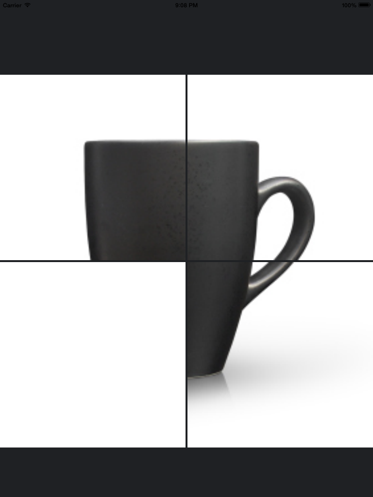

Touch Cover UIImaveView for Tiled Images

A short demo on how to create a tiled image across multiple image views and how to interact with it in a game like setting. For this example, we use one image and crop this image using a category on UIImage. This category essentially crops a certain rect within the original image. We then setup our arranged cropped images in the ```UIImageViews```.

Here is the cropping method:
```
- (UIImage *)cropImageInRect:(CGRect)rect
{
    if (self.scale > 1.0f) {
        rect = CGRectMake(rect.origin.x * self.scale,
                          rect.origin.y * self.scale,
                          rect.size.width * self.scale,
                          rect.size.height * self.scale);
    }
    
    CGImageRef imageRef = CGImageCreateWithImageInRect(self.CGImage, rect);
    UIImage *result = [UIImage imageWithCGImage:imageRef scale:self.scale orientation:self.imageOrientation];
    CGImageRelease(imageRef);
    return result;
}
```



Then we add a little interaction to show/hide the image on tap. To accomplish the show/hide, we create a cover view that matches whatever color you want. As you see in the above photo we use white. A small amount of code with lots of potential.